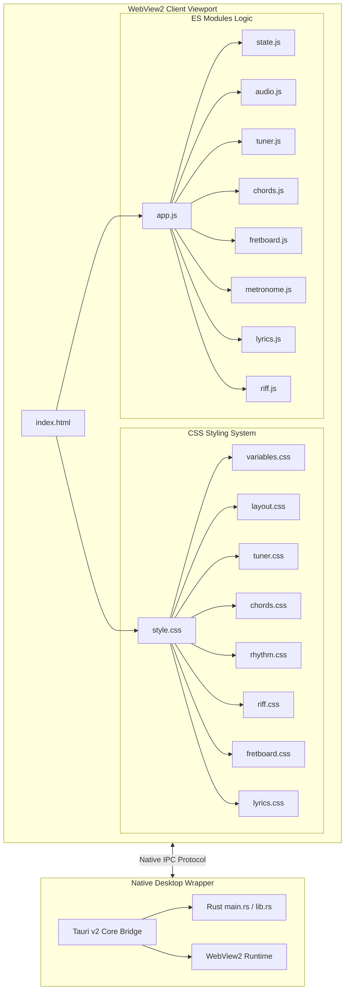

# Acoustic Companion (Yamaha F280 Companion)

Acoustic Companion is a high-performance native desktop application designed for learning and practicing Ed Sheeran's *"Photograph"* on the guitar. Optimized specifically for standard 1080p FHD displays, the application bundles an interactive guitar tuner, chord library, rhythm metronome scheduler, horizontal tab scroller player, and a scroll-synchronized lyrics sheet in an elegant, glassmorphic layout.

Powered by a native Rust backend and Webview2 frontend utilizing Tauri v2, the application runs with an extremely low memory footprint of just **3.4 MB of RAM**.

---

## Technical Architecture

The codebase is built on modern web standards and native systems engineering, structured to run efficiently without requiring bundlers, packagers, or transpilations in development.



### 1. Frontend Modular Design
The user interface is split into focused, decoupled modules served directly to the browser view:
* **Modular CSS**: Styled using isolated stylesheets assembled via standard CSS `@import` rules in `style.css`:
  * `variables.css`: Global custom properties, custom HSL color palette, resets, and glassmorphic filters.
  * `layout.css`: Flexbox grid systems, scrollable dashboard viewports, cards, and modal settings.
  * `tuner.css`: Concentric circular tuning string widgets and vibration keyframe animations.
  * `chords.css`: Styling for active chord cards, hand diagram SVG structures, and tooltip triggers.
  * `rhythm.css`: Metronome control dashboards, speed sliders, and dynamic beat pad grids.
  * `riff.css`: Horizontal tab scrollbar, string lines, clickable notes, and floating playback cursors.
  * `fretboard.css`: Neck wood texture rendering, metal frets, gold inlay dots, and finger indicator tags.
  * `lyrics.css`: Synchronized scroll containers, opacity states, and hover tooltips.
* **JavaScript ES Modules (ESM)**: Native, un-transpiled module script splitting linked via relative imports:
  * `state.js`: Global config states, capo string pitch definitions, capo-adjusted frequency calculations, and the full chronological map of the song.
  * `audio.js`: Karplus-Strong physical modeling wave synthesis, dynamic damping filters, envelope gain nodes, and metronome beep scheduling.
  * `tuner.js`: Circular tuner pick triggers, reference string plucks, and vibration timers.
  * `chords.js`: Dynamic SVG-building routines that construct chord matrices on-the-fly.
  * `fretboard.js`: Neck SVGs, string strum feedback triggers, and chord finger indicator overlays.
  * `metronome.js`: High-precision lookahead scheduler using Web Audio API timestamps and BPM averaging.
  * `lyrics.js`: Practice Mode progression loops, auto-scrolling triggers, and chord transition alarms.
  * `riff.js`: Tab tracker grids, clickable note events, speed adjustments, and linear playback timers.

### 2. Physical Modeling Audio Synthesis
Rather than loading heavy audio samples, the companion generates sound waves in real-time using an improved **Karplus-Strong physical modeling algorithm**:
* **Shaped Noise Burst**: Pluck excitation is seeded using a blend of 70% white noise and 30% sine waves to match the target frequency, adding wooden acoustic body resonance to the attack.
* **Dynamic Physics-Based Damping**: Damping ($\alpha(f)$) and feedback decay are calculated dynamically based on fundamental frequencies ($f$) to replicate the viscous drag and mechanical friction of a steel-string guitar:
  $$\alpha(f) = 0.359 + 0.00111 \cdot f$$
* **Natural Half-Life Decay**: Calculates exact 4.5 half-lives sustain times to size buffers and envelope parameters dynamically, allowing the low E string to ring out naturally for ~6.75 seconds while the high e string decays in ~4.05 seconds:
  $$\text{Duration}(f) = \frac{3.119}{0.359 + 0.00111 \cdot f}$$

### 3. Tauri Desktop Wrapper
Integrated with a lightweight Rust backend using Tauri v2:
* **Zero CORS Issues**: ES modules are loaded locally using native system protocols, bypassing browser security blocks that standard `file://` protocols encounter.
* **Low Memory Footprint**: Bypasses heavy Chromium runtime overheads (e.g. Electron) by leveraging Webview2 (Windows Edge engine), running in under 4 MB of RAM.

---

## Directory Structure

```text
acoustic-companion/
├── .github/
│   └── workflows/
│       └── publish.yml        # Automated multi-platform GitHub Actions build workflow
├── www/                       # Web static assets
│   ├── css/
│   │   ├── variables.css      # Styling custom variables & palettes
│   │   ├── layout.css         # Grid layouts & scrolling viewports
│   │   ├── tuner.css          # Tuner string badges & circular indicators
│   │   ├── chords.css         # Chord grid visual wrappers
│   │   ├── rhythm.css         # Metronome controllers & beat pad visual grids
│   │   ├── riff.css           # Timeline tracks & tab sheet scrollbars
│   │   ├── fretboard.css      # Fretboard wood styling & gold indicators
│   │   └── lyrics.css         # Sync container states & chord hovering tooltips
│   ├── js/
│   │   ├── state.js           # Shared song structures & fret math
│   │   ├── audio.js           # Web Audio context & string synthesis
│   │   ├── tuner.js           # Reference pitch tuner logic
│   │   ├── chords.js          # SVG chord grid builder
│   │   ├── fretboard.js       # Neck graphics & active overlay dots
│   │   ├── metronome.js       # Precision time scheduling & tap BPM tracking
│   │   ├── lyrics.js          # Scrolling controllers & warning indicators
│   │   └── riff.js            # Strum timelines & custom speed multipliers
│   ├── index.html             # Document entry root
│   ├── style.css              # Assembles all CSS styles
│   └── app.js                 # Bootstrapping script
├── src-tauri/
│   ├── src/
│   │   ├── main.rs            # Desktop execution entry
│   │   └── lib.rs             # Tauri application setups
│   ├── Cargo.toml             # Rust dependencies and builds
│   └── tauri.conf.json        # Tauri workspace properties
├── scripts/
│   └── install-hooks.js       # Git hooks and autonomous documentation installation utility
├── docs/                      # Technical Documentation deep-dives
│   ├── architecture.md        # ESM structure, Tauri config, and Security Hardening (Prototype validation, Reflect API)
│   ├── audio_synthesis.md     # Waveguide math equations, DSP routing, and Reflect-based buffer performance
│   ├── tuner_and_practice.md  # Precision scheduler, tap tempo math, practice loop
│   ├── contributing.md        # Actions release pipelines, Vercel cloud mirrors, and Git Pre-Commit hooks
│   └── ui_consistency_guide.md # UI Consistency & Design System Guide (variables, HSL)
├── README.md                  # Project documentation
├── CODE_OF_CONDUCT.md         # Contributor guidelines
├── SECURITY.md                # Security policy
└── vercel.json                # Vercel configuration
```

---

## Getting Started

### Prerequisites
1. **Node.js** (v18+)
2. **Rust & Cargo** (v1.75+ for Tauri v2 compilation)

### Development Command
To run the native desktop application locally with Rust logs and live-reloading:
```bash
npm run dev
```

### Production Compilation
To compile optimized standalone desktop binaries:
```bash
npm run build
```
Compiled setups will be outputted under:
* **NSIS Setup Installer**: `src-tauri/target/release/bundle/nsis/acoustic_companion_0.1.0_x64-setup.exe`
* **Enterprise MSI Installer**: `src-tauri/target/release/bundle/msi/acoustic_companion_0.1.0_x64_en-US.msi`

### Git Hooks & Autonomous Documentation
To keep the codebase and documentation synchronized during development:
* **Install Git Pre-Commit Hook**:
  ```bash
  npm run hooks:install
  ```
  This registers a pre-commit hook that automatically runs `docs:update` on staged files before every commit.
* **Manual Documentation Update**:
  ```bash
  npm run docs:update
  ```

---

## Cloud Hosting & Deployment

The static front-end assets can be easily hosted on Vercel:

1. Push your repository to **GitHub**.
2. Connect your project to **Vercel**.
3. Configure the **Project Settings**:
   * **Framework Preset**: `Other`
   * **Root Directory**: `www` (Ensures Vercel skips native Rust files and serves the front-end directory directly)
4. Click **Deploy**. Vercel will host the modular ESM files on a high-speed CDN.
