# System Architecture Documentation

Acoustic Companion utilizes a decoupled, modern frontend-to-native architecture that runs cleanly in standard web environments and compiles into a high-performance Windows desktop application. 

This document outlines the visual layout structures, native browser ES module (ESM) systems, and Tauri webview bindings.

---

## 1. Directory Blueprint

The project segregates static web client assets (`/www`) from native compilation code (`/src-tauri`), maintaining clean separation of concerns and ease of maintenance:

```text
Photograph/
├── www/                       # Frontend web assets (HTML/CSS/JS)
│   ├── css/                  # Isolated stylesheets (Layout, buttons, widgets)
│   ├── js/                   # Browser-native JavaScript ES Modules
│   ├── index.html            # Core document root
│   ├── style.css             # CSS entry point assembling modules
│   └── app.js                # JS bootstrapper and page initializer
├── src-tauri/                 # Native systems compilation files
│   ├── src/                  # Rust source files (main, lib)
│   ├── Cargo.toml            # Rust cargo package configuration
│   └── tauri.conf.json       # Tauri window properties and build scopes
```

---

## 2. Bootstrapping & Script Lifecycle

Because browser modules are loaded asynchronously, standard `DOMContentLoaded` event triggers can cause race conditions if the event fires before the module finishing loading. The dashboard resolves this using a loading state check:

```mermaid
sequenceDiagram
    autonumber
    participant Browser as Web Browser Viewport
    participant App as app.js (Entry Point)
    participant State as js/state.js
    participant Audio as js/audio.js
    participant UI as Component UI Modules

    Browser->>App: Loads type="module" app.js
    App->>State: Imports global state & song sheets
    App->>Audio: Imports synthesis context & clicks
    App->>UI: Imports chords, fretboard, metronome
    
    rect rgb(20, 20, 20)
        Note over App: Check document.readyState
        alt document.readyState === "loading"
            App->>Browser: Listen for DOMContentLoaded
            Browser-->>App: DOMContentLoaded Fires
            App->>App: Execute bootstrap()
        else document.readyState already complete
            App->>App: Execute bootstrap() immediately
        end
    end

    App->>UI: Render fretboards, grids, tabs, sheets
    App->>UI: Bind Tuner / Metronome click listeners
    App->>Browser: Display active maximized interface
```



---

## 3. Desktop Compilation (Tauri v2)

Tauri serves as a secure native desktop bridge for the application:
* **Edge WebView2 Runtime**: Compiles the web view into a Windows application shell, leveraging Microsoft's local engine.
* **Asset Loading (No CORS)**: Web assets are served directly through an internal systems loop. This native serving bypasses CORS restrictions that block standard `file://` protocol ES module loads, allowing clean local execution.
* **Low Memory Footprint**: Bypasses Chromium processes to run in under 4 MB of active RAM, outperforming standard Electron wrappers by orders of magnitude.
