# Technical Architecture & System Design

Acoustic Companion utilizes a decoupled, high-performance frontend-to-native architecture that runs cleanly in standard modern web environments and compiles into a native Windows desktop application. 

This document outlines the file layout structures, browser-native JavaScript ES Module (ESM) systems, script load lifecycles, and Tauri WebView2 system bindings.

---

## 1. Directory Structure Blueprint

The codebase maintains a strict separation of concerns, isolating modular web client assets (`/www`) from native compilation code (`/src-tauri`):

```text
acoustic-companion/
├── www/                       # Frontend Web assets (HTML/CSS/JS)
│   ├── css/                  # Isolated stylesheets (Variables, layouts, components)
│   │   ├── variables.css      # Core HSL color variables, theme definitions, resets
│   │   ├── layout.css         # Flex grids, glassmorphism containers, viewports
│   │   ├── tuner.css          # Tuner string layouts, interactive animations
│   │   ├── chords.css         # Chord grid lists, hand matrix visual styling
│   │   ├── rhythm.css         # Metronome beat panels, sliding BPM dials
│   │   ├── riff.css           # String-by-string tracks, linear cursor tracks
│   │   ├── fretboard.css      # Wood veneer texture styling, metal fret bars
│   │   └── lyrics.css         # Scrolling panels, line highlights, tooltips
│   ├── js/                   # Browser-native JavaScript ES Modules
│   │   ├── state.js           # Shared variables, chord matrix mappings, song schedules
│   │   ├── audio.js           # Physical synthesis models, click pulses, gain nodes
│   │   ├── tuner.js           # Circular pitch buttons, reference pick triggers
│   │   ├── chords.js          # SVG matrix builders, dynamic drawing loops
│   │   ├── fretboard.js       # Neck graphics, visual overlays, string vibes
│   │   ├── metronome.js       # High-precision time intervals, tap tempo smoothing
│   │   ├── lyrics.js          # Practice loops, DOM scrolls, warning transition flashes
│   │   └── riff.js            # Clickable tab timelines, speed dials, playing heads
│   ├── index.html            # Core document root
│   ├── style.css             # Assembles isolated stylesheet imports
│   └── app.js                # System bootstrapper and module initializer
├── docs/                      # Technical Documentation deep-dives
│   ├── architecture.md        # Technical architecture, ESM loading, Tauri config
│   ├── audio_synthesis.md     # Mathematical synthesis equations & node routing
│   ├── tuner_and_practice.md  # Precision scheduler, tap tempo math, practice loop
│   ├── contributing.md        # Multi-platform Actions build, environment, Vercel
│   └── ui_consistency_guide.md # UI Consistency & Design System Guide (variables, HSL)
└── src-tauri/                 # Native systems compilation files
    ├── src/                  # Rust source files (main.rs, lib.rs)
    ├── Cargo.toml            # Rust Cargo package manager properties
    └── tauri.conf.json        # Tauri build profiles and window dimensions
```

---

## 2. Bootstrapping & Script Lifecycle

Because ES Modules are loaded asynchronously via `<script type="module">`, standard `DOMContentLoaded` event triggers can cause race conditions. If the browser finishes parsing the document structure *before* the asynchronous JS script and its sub-imports have finished downloading and compiling, a standard `DOMContentLoaded` listener bound within the module will never fire, locking the UI in an uninitialized state.

To bypass this race condition, `app.js` queries `document.readyState` directly. If the document is still loading, it binds to `DOMContentLoaded`. If the document is already parsed, it triggers the bootstrapper synchronously:

```javascript
if (document.readyState === "loading") {
    document.addEventListener("DOMContentLoaded", bootstrap);
} else {
    bootstrap();
}
```



```mermaid
sequenceDiagram
    autonumber
    participant Browser as Web Browser Viewport
    participant App as app.js (Entry Point)
    participant State as js/state.js
    participant Audio as js/audio.js
    participant UI as Component UI Modules

    Browser->>App: Loads type="module" app.js
    App->>State: Imports global state & song sheets
    App->>Audio: Imports synthesis context & clicks
    App->>UI: Imports chords, fretboard, metronome
    
    rect rgb(30, 30, 35)
        Note over App: Check document.readyState
        alt document.readyState === "loading"
            App->>Browser: Listen for DOMContentLoaded
            Browser-->>App: DOMContentLoaded Fires
            App->>App: Execute bootstrap()
        else document.readyState already complete
            App->>App: Execute bootstrap() immediately
        end
    end

    App->>UI: Render fretboards, grids, tabs, sheets
    App->>UI: Bind Tuner / Metronome click listeners
    App->>Browser: Display active maximized interface
```

### The `bootstrap()` Operations
Upon entering `bootstrap()`, the following components are initialized sequentially:
1. **Practice Compilation**: `compilePracticeMap()` in `state.js` compiles the song's verse, chorus, and bridge configurations into a linear, bar-by-bar sequence (`flatPracticeMap`).
2. **UI Rendering**: 
   * `renderChordLibrary()` structures the sidebar chord selection widgets.
   * `drawFretboard()` outputs the initial wood neck neck lines.
   * `renderBeatGrid()` draws the metronome's 8-part beat panels.
   * `renderPracticeBoard()` renders the lyrics and syncs the SVG chord hover tooltips.
   * `renderRiffTab()` draws the horizontal tab sheets.
3. **Interactive UI Binding**:
   * `setupTunerUI()` binds references string events.
   * `setupMetronomeUI()` binds BPM controls and Tap Tempo button.
   * `setupPracticeUI()` binds Practice mode controls and section navigation.
   * `setupRiffUI()` binds the Tab riff player and speed controls.
   * Standard volume sliders, mute controls, and setup overlays.

---

## 3. Native Desktop Wrapper (Tauri v2)

Tauri serves as a secure, high-performance desktop bridge for the application, compiling the static `/www` directory into a native executables bundle:

* **WebView2 Integration**: Relies on the host operating system's native WebView engine (Microsoft WebView2/Edge on Windows, WebKit on macOS, WebKitGTK on Linux), completely avoiding the heavy Chromium process overhead typical of Electron-style wrappers.
* **Low Memory Footprint**: Bypasses the need for background packaging or Node runtimes, executing in under **4 MB of active RAM**.
* **Zero CORS Local ESM Loading**: Modern browsers block standard ES module relative imports when loaded via the `file://` protocol due to Cross-Origin Resource Sharing (CORS) security restrictions. Tauri solves this by serving the static `/www` assets directly through a local system loop (`tauri://localhost` or native IPC protocols), providing full compatibility with ESM without requiring local bundlers or web servers during development.
* **Maximized Display Configuration**: `tauri.conf.json` defines window behaviors to launch the application maximized, ensuring optimal 1080p layout alignments out-of-the-box:
  ```json
  "windows": [
    {
      "title": "Acoustic Companion",
      "width": 1280,
      "height": 800,
      "resizable": true,
      "fullscreen": false,
      "maximized": true
    }
  ]
  ```
