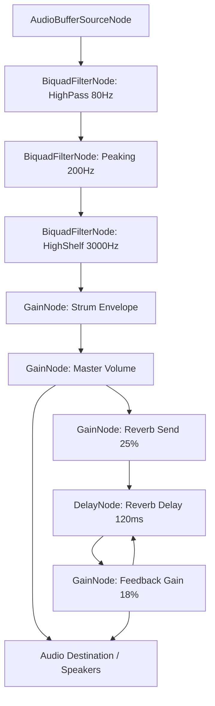

# Audio Synthesis & Karplus-Strong Waveguide

Acoustic Companion utilizes real-time **Karplus-Strong physical modeling synthesis** to generate realistic steel-string guitar tones directly in the client browser, completely bypassing the memory overhead of loading heavy audio sample files.

---

## 1. Physical Waveguide Principles

The synthesis engine models the physics of a plucked string using a closed feedback loop:
1. **Excitation (The Pluck)**: The string is excited using a short burst of noise. We seed the buffer with a combination of white noise and a sine wave component matching the period of the fundamental frequency ($f$). This sine component adds immediate wood-like acoustic body warmth to the initial attack.
2. **Delay Line**: The noise burst circulates through a delay line whose sample length corresponds exactly to the period of the target note:
   $$N = \text{Sample Rate} / f$$
3. **Low-Pass Averaging (String Stiffness)**: As the wave circulates, a 3-point weighted average filter simulates the internal friction, string stiffness, and mechanical damping of the metal core:
   $$y[n] = 0.1 \cdot y[n-2] + B \cdot y[n] + (0.9 - B) \cdot y[n-1]$$
   *(Where $B$ is a dynamic high-frequency detuning factor to maintain acoustic warmth).*
4. **Feedback Loop Damping**: The wave is multiplied by a feedback coefficient ($g < 1.0$) on each cycle, simulating energy dissipation.

---

## 2. String-Specific Damping Mathematics

To mirror the acoustics of a premium steel-string acoustic guitar (where low-frequency bass strings ring out significantly longer than high-frequency treble strings), the engine calculates string damping dynamically.

The damping coefficient $\alpha(f)$ varies linearly with the frequency $f$ to account for both air friction (viscous drag, baseline) and internal structural friction (increases with frequency):
$$\alpha(f) = 0.359 + 0.00111 \cdot f$$

The amplitude half-life $t_{1/2}$ represents the time taken for the sound amplitude to decay by 50%:
$$t_{1/2}(f) = \frac{\ln(2)}{\alpha(f)}$$

To determine the natural fade threshold (4.5 half-lives, or decay to $2^{-4.5} \approx 4.4\%$ of the initial amplitude), the engine calculates the dynamic duration:
$$\text{Duration}(f) = 4.5 \cdot t_{1/2}(f) = \frac{3.119}{0.359 + 0.00111 \cdot f}$$

These equations yield realistic sustain envelopes across the guitar's register:
* **Low E (92.5 Hz)**: sustains for **~6.75 seconds**.
* **High e (370.0 Hz)**: sustains for **~4.05 seconds**.

---

## 3. Web Audio Node Routing

The generated waveguide sample buffers are piped through standard Web Audio filters to sculpt the final acoustic timbre:

* **High-Pass Filter**: Cuts sub-bass rumble below 80 Hz to preserve mixing headroom.
* **Peaking Filter**: Adds a +4 dB boost at 200 Hz to simulate the natural wooden resonance of a guitar body.
* **High-Shelf Filter**: Adds a +2 dB boost at 3000 Hz for pick attack clarity.
* **Gain Envelope**: Implements linear attack ramps (3ms) and exponential release curves matching the physically computed string duration.
