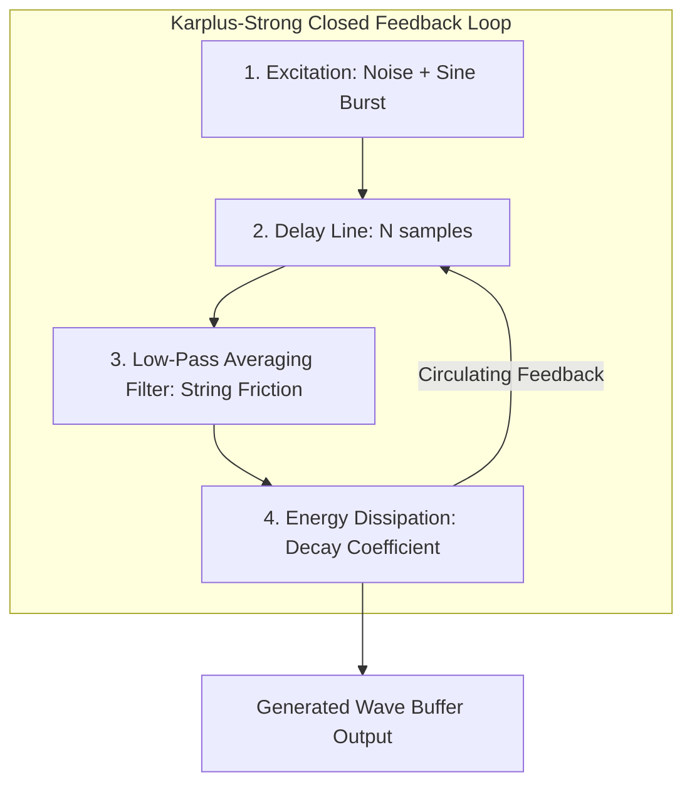
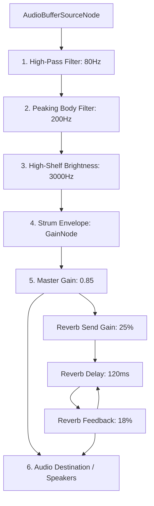

# Real-Time Physical Modeling & Audio Synthesis

Acoustic Companion bypasses the massive memory overhead of loading heavy audio sample files by generating realistic steel-string guitar tones in real-time. This is achieved using an **improved Karplus-Strong physical modeling algorithm** implemented via the browser's Web Audio API.

This document details the mathematical models, delay line filters, dynamic string damping parameters, and signal routing chains used in the synthesis engine.

---

## 1. Physical Waveguide Principles

The synthesis engine models the physics of a plucked string using a closed feedback loop:

### 1. The Pluck Excitation (Shaped Noise Burst)
Traditional Karplus-Strong models excite the waveguide using standard white noise. While this creates a realistic attack, it often results in a thin, synthetic sustain. 

To introduce wooden acoustic warmth, Acoustic Companion seeds the initial delay buffer with a shaped blend of **70% white noise** and **30% pure sine wave** matching the period of the fundamental frequency ($f$):

$$x[n] = \text{noise}[n] \cdot 0.7 + \sin\left(\frac{2 \cdot \pi \cdot n}{N}\right) \cdot 0.3 \quad \text{for} \quad 0 \le n < N$$

Where:
* $\text{noise}[n]$ is a random value in the range $[-1.0, 1.0]$.
* $N$ is the period length in samples, calculated as:
  $$N = \text{round}\left(\frac{\text{Sample Rate}}{f}\right)$$

### 2. Low-Pass Averaging Filter (String Stiffness)
As the excited wave circulates through the delay line, a three-point averaging filter simulates the internal friction, mechanical damping, and high-frequency dispersion (string stiffness) of a metal core. 

$$avg[n] = 0.1 \cdot y[n - N - 1] + B \cdot y[n - N] + (0.9 - B) \cdot y[n - N + 1]$$

Where:
* $y[n]$ is the current synthesized output sample.
* $y[n - N]$ is the sample from one full period ago.
* $B$ is the dynamic detuning blend factor, calculated based on the target frequency to maintain wood-like acoustic warmth:
  $$B = 0.48 + 0.04 \cdot \text{brightnessFactor}$$
  *(where $\text{brightnessFactor} = \min\left(1.0, \frac{f}{600}\right)$)*

### 3. Feedback Loop Damping
To simulate the loss of energy as the wave bounces between the nut (or fret) and the bridge, the filtered average is multiplied by a feedback coefficient $g$:

$$y[n] = g \cdot avg[n]$$

Where $g$ is a dynamic decay factor calculated based on the string frequency:
$$g = 0.9982 - 0.0012 \cdot \text{brightnessFactor}$$

This dynamic blend and decay structure ensures that high-frequency treble strings decay their high-end energy slightly quicker than bass strings, preventing synthetic harshness.

---

## 2. Dynamic Damping & Sustain Mathematics

Steel-string acoustic guitars exhibit a wide range of sustain times: thick bass strings ring out for several seconds, while thin treble strings decay rapidly due to air resistance and internal friction.

To replicate this, Acoustic Companion calculates the string damping coefficient ($\alpha(f)$) as a linear function of the fundamental frequency ($f$):

$$\alpha(f) = 0.359 + 0.00111 \cdot f$$

The amplitude half-life ($t_{1/2}(f)$) represents the time in seconds for the string's sound amplitude to decay by 50%:

$$t_{1/2}(f) = \frac{\ln(2)}{\alpha(f)}$$

To determine the natural fade threshold (4.5 half-lives, representing decay to $2^{-4.5} \approx 4.4\%$ of the initial attack amplitude), the engine dynamically sizes the buffer length and gain envelopes:

$$\text{Duration}(f) = 4.5 \cdot t_{1/2}(f) = \frac{4.5 \cdot \ln(2)}{\alpha(f)} \approx \frac{3.119}{0.359 + 0.00111 \cdot f}$$

This models precise sustain profiles across the fretboard register:
* **Low E String (Capo 2nd Fret = F#2, 92.5 Hz)**:
  $$\alpha(92.5) = 0.359 + 0.00111 \cdot 92.5 = 0.4616$$
  $$\text{Duration} = \frac{3.119}{0.4616} \approx \mathbf{6.75\text{ seconds}}$$
* **High e String (Capo 2nd Fret = F#4, 370.0 Hz)**:
  $$\alpha(370.0) = 0.359 + 0.00111 \cdot 370.0 = 0.7697$$
  $$\text{Duration} = \frac{3.119}{0.7697} \approx \mathbf{4.05\text{ seconds}}$$

---

## 3. Web Audio Node Routing

Once the waveguide buffer is computed, the source node is piped through a multi-stage filtering and reverb send pipeline:

### 1. High-Pass Filter (Low-Cut)
A standard 12 dB/octave high-pass filter cuts unwanted rumble below 80 Hz ($Q=0.7$). This preserves mixing headroom and prevents sub-bass clipping.

### 2. Peaking Body Filter (Wood Resonance)
To simulate the wooden acoustic box resonance of a guitar body, a peaking filter introduces a **+4 dB boost at 200 Hz** ($Q=1.5$). This adds warmth and body depth to the pluck attack.

### 3. High-Shelf Filter (Brightness)
A high-shelf filter introduces a **+2 dB boost at 3000 Hz** to emphasize the pick attack, mimicking the bright "zing" of steel strings against a plectrum.

### 4. Gain Strum Envelope
A fast-acting gain envelope shapes the amplitude timeline, using high-precision Web Audio clock scheduling to prevent pops:
* **Attack Phase**: 3ms linear ramp from `0` to $V_{\text{target}}$ (e.g. `0.45` strum volume) to simulate the speed of a plectrum sliding off a steel wire.
* **Hold Phase**: Holds peak volume for 7ms (at time $+ 10$ms).
* **Decay Phase**: Exponentially ramps down to $60\%$ of peak volume over 70ms (at time $+ 80$ms) to simulate the initial shock decay.
* **Sustain/Release Phase**: Exponentially decays to `0.001` over the remainder of the calculated physical string duration (`computedDuration`).

### 5. Reverb Feedback Delay
To place the acoustic guitar in a natural room, a parallel reverb send chain branches from the Master Gain:
* **Send volume**: `25%`
* **Delay time**: `120ms`
* **Feedback gain**: `18%`
* The feedback loop runs continuously: `reverbDelay → reverbGain → reverbDelay`, feeding a lush, organic decay tail into the final speaker destination.
