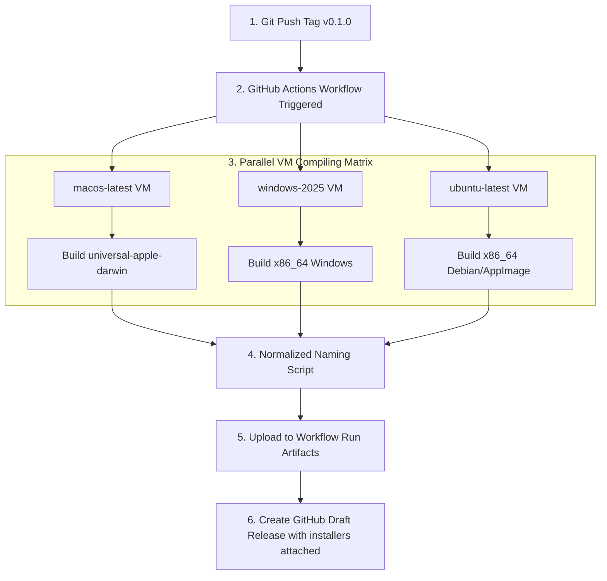

# Contribution & Developer Release Guide

Welcome to the Acoustic Companion developer guide. This document serves as a comprehensive reference for setting up local environments, building and packaging production binaries, deploying cloud mirrors, and managing automated multi-platform release pipelines.

---

## 1. Local Environment Setup

To establish a local compiling and debugging environment, ensure the following system prerequisites are satisfied:

### 1. Prerequisites by Operating System
* **All Platforms**: **Node.js** (v18 or higher recommended) and **npm** for dependencies management.
* **Windows**: **WebView2 Runtime** (installed by default in Windows 10/11) and **Visual Studio C++ Build Tools** (Build Tools with C++ desktop development workload).
* **macOS**: **Xcode Command Line Tools** (`xcode-select --install`).
* **Linux (Debian/Ubuntu)**: Tauri v2 requires specific libraries for WebKitGTK and native systems operations. Install them using `apt`:
  ```bash
  sudo apt-get update
  sudo apt-get install -y libwebkit2gtk-4.1-dev build-essential curl wget file libxdo-dev libssl-dev libayatana-appindicator3-dev librsvg2-dev
  ```

### 2. General Setup Instructions
1. Clone the codebase locally:
   ```bash
   git clone https://github.com/GaragaKarthikeya/acoustic-companion.git
   ```
2. Navigate to the project root directory and install node modules:
   ```bash
   npm install
   ```
3. Establish your Rust compiler toolchain using `rustup`:
   ```bash
   rustup default stable
   ```

---

## 2. Developer Build & Run Commands

The root `package.json` maps CLI scripts to compile and launch Tauri's native rust engine and WebView viewports:

```bash
# Launch a development viewport with Hot Module Replacement (HMR) and Rust debug logging
npm run dev

# Compile optimized release builds and bundle installer files
npm run build
```

Upon executing `npm run build`, the native Rust compilations are cached under `src-tauri/target/release/` and packaged into standard platforms setups:
* **Windows setups**:
  * **NSIS EXE Installer**: `src-tauri/target/release/bundle/nsis/acoustic_companion_0.1.0_x64-setup.exe`
  * **Enterprise MSI Installer**: `src-tauri/target/release/bundle/msi/acoustic_companion_0.1.0_x64_en-US.msi`
* **macOS setups**: Compiled as standard Apple Disk Image `.dmg` wrappers or universal `.app.tar.gz` packages.
* **Linux setups**: Compiled as standard Debian `.deb` packages or AppImage wrappers.

## 3. Cloud Deployment (Vercel)

The `/www` frontend is fully static and complies with standard browser module scripts. It can be hosted on a cloud CDN using Vercel:

1. Import the repository into your Vercel Dashboard.
2. Configure **Project Settings** precisely as follows:
   * **Framework Preset**: `Other`
   * **Root Directory**: `www`
   * *(Crucial: This isolates frontend static assets, skipping Tauri's Rust directories during the cloud build phase)*.
3. Click **Deploy**. Vercel will host the modular ESM files globally over high-speed static CDNs.

---

## 4. Automated Multi-Platform Releases (GitHub Actions)

Acoustic Companion features a robust CI/CD workflow defined in `.github/workflows/publish.yml`. When triggered by a tagged push, the workflow provisions virtual machines to compile cross-platform installer binaries simultaneously.



### 1. Build Architecture Matrix
The workflow runs three parallel build jobs across different virtual runners:
1. **macOS Universal**: Builds universal Apple Silicon and Intel binaries by installing targets `aarch64-apple-darwin` and `x86_64-apple-darwin`, compiled using the cargo argument `--target universal-apple-darwin`.
2. **Windows x86_64**: Compiles on a `windows-2025` runner to output setup executables and MSI installers.
3. **Linux x86_64**: Compiles on an `ubuntu-latest` runner after installing WebKitGTK and app indicator libraries.

### 2. Version Extraction and Bundle Normalization
To keep names uniform across different matrix runs, the actions script runs a Bash step that extracts the application version from `tauri.conf.json`:

```bash
VERSION=$(node -e "console.log(require('./src-tauri/tauri.conf.json').version)")
```

Then, a normalization script sweeps the bundle folders, remapping output files to a clean target directory (`dist/`) using clean naming patterns:

> `acoustic_companion-{version}-{system}-{kind}.{ext}`

* **`system`**: maps to `macos-universal`, `windows-x86_64`, or `linux-x86_64`.
* **`kind`**:
  * `.app.tar.gz` $\rightarrow$ `updater` (for Tauri updater channels)
  * `*setup.exe` $\rightarrow$ `setup`
  * Standard extensions (e.g. `.msi`, `.dmg`, `.deb`, `.AppImage`) $\rightarrow$ lower-case extensions representing the installer format.

### 3. Automated Draft Release Creation
1. The workflow caches Rust compilation targets across runs to reduce build times using `swatinem/rust-cache@v2`.
2. Normalized artifacts are uploaded temporarily using `actions/upload-artifact@v7`.
3. The final `publish-release` job runs in a clean Ubuntu workspace, downloads all artifacts, and creates a **draft GitHub Release** using `softprops/action-gh-release@v2`. 
4. The tagged version is published immediately as a draft with all multi-platform setups pre-attached as release assets!

### How to Trigger an Automated Release Build
1. Increment the version string inside `src-tauri/tauri.conf.json` and `package.json` (e.g. `"0.1.1"`).
2. Commit and push the version updates to `main`.
3. Create a matching tag and push it:
   ```bash
   git tag v0.1.1
   git push origin v0.1.1
   ```
4. Check your repository's **Actions** tab to watch the build runners compile. Once finished, check the **Releases** tab to publish the pre-packaged draft.

---

## 5. Build Compatibility: npm build vs. tauri build

While a frontend project that compiles successfully with standard web builds (e.g., `npm run build` or Vite/Webpack pipelines) will **mostly** run without issues inside a Tauri wrapper, there are three critical edge cases that developers must account for:

### 1. Absolute vs. Relative Paths (The Blank Screen Pitfall)
* **Web Behavior**: Browsers on standard domains allow absolute resource paths (e.g., `/css/style.css` or `/js/app.js`) because they resolve relative to the host domain root (`https://domain.com`).
* **Tauri Behavior**: Tauri serves assets locally through custom system protocols (`tauri://localhost` or local IPC loops) rather than standard domains. If absolute paths are used, the host operating system's WebView engine will attempt to locate files at the root of the OS filesystem (e.g., `C:\css\style.css` on Windows), resulting in immediate 404 asset loading failures and a **blank white screen**.
* **Best Practice**: Always configure your frontend packagers and asset imports to use **relative paths** (e.g., `./css/style.css`). In bundlers like Vite, this is achieved by setting `base: './'` or `base: ''` in `vite.config.js`.

### 2. Cross-Origin Resource Sharing (CORS) & External APIs
* **Web Behavior**: Browsers allow asynchronous `fetch` requests to third-party endpoints if the external server's HTTP response headers explicitly include your domain origin in their `Access-Control-Allow-Origin` values.
* **Tauri Behavior**: Because Tauri applications run under custom, non-standard local protocols (`tauri://localhost` or system loop origins), external servers may reject requests because the origin is unrecognizable or considered untrusted.
* **Best Practice**: You must configure third-party APIs to explicitly allow your Tauri system loop origin, or utilize **Tauri's native HTTP Client Plugin** (`tauri-plugin-http`) in the Rust backend. This plugin bypasses browser-level sandboxed CORS restrictions completely by performing requests in the native system shell.

### 3. Native Compilers & Rust Errors
* **Web Behavior**: Standard web build scripts only check for syntax issues, bundle sizes, and asset loading.
* **Tauri Behavior**: A production compilation (`npx tauri build`) triggers a **native binary build** using the local Rust compiler (`rustc`) and native platform SDK tools (MSVC on Windows, Xcode on macOS, or WebKitGTK/Debian headers on Linux). 
* **Best Practice**: If a Tauri build fails even though the frontend built successfully, check:
  * That your system developer tools are completely installed (Visual Studio C++ Build Tools on Windows, Xcode Command Line Tools on macOS, or `libwebkit2gtk-4.1-dev` and build-essential on Linux).
  * That `"frontendDist"` in `src-tauri/tauri.conf.json` points to the exact relative path of the compiled frontend assets folder (e.g., `"../www"` or `"../dist"`).
  * That the native Rust code (`main.rs` and `lib.rs`) and backend plugins contain no Rust compiler errors.

