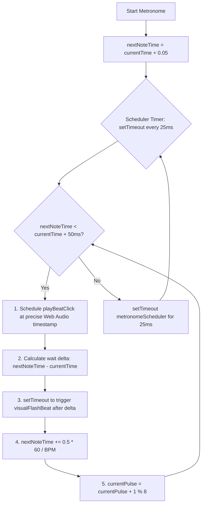

# Metronome Scheduler & Practice Board Synchronization

Acoustic Companion features a high-precision metronome scheduler, a tap tempo tracking system, and a dynamically synchronized practice engine. This document details the lookahead scheduling algorithms, the mathematics of tap tempo smoothing, and the event-driven lyrics and chord synchronization loops.

---

## 1. High-Precision Lookahead Scheduler

JavaScript's standard timing loops (`setInterval` or `setTimeout`) run on the browser's main execution thread. If the main thread is busy rendering UI, garbage collecting, or scrolling, these timers are subject to arbitrary delays, making them too unstable for a musical metronome.

To solve this, the metronome combines lightweight scheduling intervals with the high-precision hardware clock of the Web Audio API (`audioCtx.currentTime`):



### 1. Scheduler Parameters
* **`LOOKAHEAD`**: `25.0 ms`. The frequency with which the scheduler runs.
* **`SCHEDULE_WINDOW`**: `50.0 ms`. How far into the future the scheduler searches for beats to queue. By scheduling notes 50ms in advance, we ensure that even if a thread block occurs, the audio driver already holds the next beat buffer.

### 2. Audio Scheduling Loop
The scheduler runs a recursive timeout loop `metronomeScheduler()` that continuously schedules audio beats until stopped:

```javascript
function metronomeScheduler() {
    while (nextNoteTime < audioCtx.currentTime + (SCHEDULE_WINDOW / 1000)) {
        scheduleBeat(currentPulse, nextNoteTime);
        advanceBeat();
    }
    schedulerTimer = setTimeout(metronomeScheduler, LOOKAHEAD);
}
```

Each pulse represents an eighth note. The scheduler advances time using the formula:

$$\Delta t_{\text{beat}} = 0.5 \cdot \left(\frac{60.0}{\text{BPM}}\right) = \frac{30.0}{\text{BPM}}$$

$$\text{nextNoteTime}_{k+1} = \text{nextNoteTime}_k + \Delta t_{\text{beat}}$$

$$\text{pulse}_{k+1} = (\text{pulse}_k + 1) \pmod 8$$

### 3. Precision Visual Synchronization
To ensure visual elements flash in sync with the hardware audio output, `scheduleBeat` computes the exact millisecond delta remaining between the CPU's current execution time and the scheduled Web Audio play time, firing a zero-clamped timeout:

$$\text{Delay}_{\text{visual}} = \max(0, (\text{nextNoteTime} - \text{audioCtx.currentTime}) \cdot 1000)$$

---

## 2. Tap Tempo Smoothing Mathematics

The Tap Tempo feature allows users to set the BPM organically by tapping a button. To maintain engine stability and filter out erratic physical taps, the tracker applies a multi-stage smoothing algorithm:

### 1. Old Tap Filtering
Upon clicking the tap button, the engine fetches `performance.now()` and purges any tap timestamps older than **2.2 seconds (2200ms)**. This filters out old tap history and allows the user to easily reset and start a new tempo tracking session:

$$t_{\text{filtered}} = \{ t_i \in T \mid t_{\text{now}} - t_i < 2200\text{ ms} \}$$

### 2. Interval Averaging
The time difference between consecutive remaining taps is calculated:

$$\Delta t_i = t_i - t_{i-1} \quad \text{for} \quad 1 \le i < M$$

The average tapping interval is computed:

$$\text{Average}(\Delta t) = \frac{1}{M-1} \sum_{i=1}^{M-1} \Delta t_i$$

### 3. BPM Calculation & Clamping
The final BPM is computed and clamped securely between **50 BPM** (slow practice) and **160 BPM** (fast strumming) to keep the lookahead scheduler buffers within stable memory sizes:

$$\text{BPM}_{\text{computed}} = \text{round}\left(\frac{60,000}{\text{Average}(\Delta t)}\right)$$

$$\text{BPM}_{\text{final}} = \max\left(50, \min\left(160, \text{BPM}_{\text{computed}}\right)\right)$$

---

## 3. Practice Board Synchronization Loop

During **Practice Mode**, the precision metronome acts as the master clock. It drives all front-end lyrics, scrolls, chord diagrams, and section highlights on specific pulse triggers:

### 1. Chronological Section Compiling
The application flattens the structured verse/chorus schema of *"Photograph"* into a bar-by-bar array (`flatPracticeMap`) upon boot:

$$\text{flatPracticeMap}[b] \longrightarrow \{ \text{absoluteBar}, \text{section}, \text{relativeBar}, \text{chord}, \text{style}, \text{triggerLineId} \}$$

### 2. Chord Change Warning (Pulse 6 Trigger)
To help beginners transition their fretting hands in time, a split-second warning is triggered on **Pulse 6 (Beat 4 &)** of the preceding bar:
1. The engine checks if the upcoming bar features a chord change:
   $$\text{chord}_{b+1} \ne \text{chord}_b$$
2. If a chord change is imminent, the engine retrieves the next bar's chord badge:
   `badge-pract-${nextInfo.section}-${nextInfo.relativeBar}`
3. It appends the `warning-transition` class, triggering an **amber flashing keyframe animation** that warns the user to prepare their fingers.

### 3. Active Bar Initialization (Pulse 0 Trigger)
On **Pulse 0 (Beat 1)** of every bar, the engine executes a comprehensive layout synchronization loop:
* **Reset Transition Flashes**: Removes all `warning-transition` classes from the DOM.
* **Update Metrics**: Calculates active bar progress:
  $$\text{Progress} = \frac{b_{\text{current}}}{b_{\text{total}}} \cdot 100\%$$
  Updates the `#practice-progress-fill` width bar.
* **Update Prompts**: Updates target indicators to show `"Keep playing: [Chord]"` or `"Up Next: [Next Chord]"`.
* **Redraw Fretboard**: Fetches the active chord fingering from `CHORD_LIBRARY[chord]` and updates the `#fretboard-neck` SVG overlay dots.
* **Highlight Cheat Sheet**: Locates the active chord name in the left progression cheat sheet and toggles the `.active` class.
* **Synchronize Lyrics Scroll**: If the bar contains an active lyrics line trigger (`triggerLineId`), the engine dims all other lyrics lines to `opacity: 0.3`, highlights the active line to `opacity: 1.0`, and centers it smoothly in the viewport:
  ```javascript
  line.scrollIntoView({ behavior: 'smooth', block: 'center' });
  ```

---

## 4. Acoustic-to-Visual Pitch Mapping & String Flashing

When an audio pluck occurs—either via chord strums, manual tab clicks, or the metronome practice guide—the application triggers real-time visual vibration feedback on the gold-stringed Fretboard Neck view. This transition uses a logarithmic acoustic-to-digital translation algorithm:

### 1. Frequency-to-MIDI Logarithmic Translation
Any acoustic frequency ($f$) generated by the waveguide is translated into standard chromatic MIDI pitch numbers ($M$) using logarithmic equal temperament formulas:

$$M = \text{round}\left(12 \cdot \log_2\left(\frac{f}{440}\right) + 69\right)$$

This maps arbitrary synthesised hertz values directly to absolute musical semitone slots.

### 2. Minimum-Delta String Target Search
Because the same note can theoretically be played at different locations across different strings, the Fretboard engine (`triggerStringFlash` in `fretboard.js`) loops through all 6 physical strings and 7 visual frets to identify the exact string that is physically playing the frequency:

$$\text{Target String} = \arg\min_{S \in \{1..6\}} \left( \min_{F \in \{0..7\}} \left| M - \text{MidiNum}(f_{S, F}) \right| \right)$$

For each candidate string $S$ and fret $F$:
1. The engine calculates the expected fret frequency $f_{S, F}$ and converts it to a MIDI slot $M_{S, F}$.
2. It measures the absolute distance: $\text{diff} = |M - M_{S, F}|$.
3. It updates the target search to remember the string that yielded the absolute closest matching frequency.

### 3. Vibration Keyframe Triggering
Once the target string index $S$ is identified:
1. The engine fetches the matching HTML string wire element:
   `#fret-string-wire-${closestString}`
2. It appends the `.strummed` class, which fires a fast CSS animation simulating string vibration:
   ```css
   @keyframes string-vibrate {
       0% { transform: translateY(0); stroke: var(--accent-gold); filter: drop-shadow(0 0 4px var(--accent-gold)); }
       25% { transform: translateY(-0.8px); }
       75% { transform: translateY(0.8px); }
       100% { transform: translateY(0); }
    }
    ```
3. A `setTimeout` removes the class after exactly **150ms** to return the string to a stable resting state.

---

## 5. Riff Melody Scheduler & Speed Multiplier Math

The Riff Melody engine (`riff.js`) provides an autonomous playback mode for fingerstyle sequence practice. The timing of each played note is calculated dynamically relative to the master BPM and a user-selected speed multiplier.

### 1. Eighth Note Duration Calculations
Riff sequences are built on discrete eighth-note intervals. The baseline duration of a single eighth-note unit ($t_{\text{eighth}}$) is calculated from the master tempo in Beats Per Minute ($\text{BPM}$):

$$t_{\text{quarter}} = \frac{60,000}{\text{BPM}}\text{ ms}$$

$$t_{\text{eighth}} = 0.5 \cdot t_{\text{quarter}} = \frac{30,000}{\text{BPM}}\text{ ms}$$

### 2. Speed-Scaled Interval Scheduling
Each note in the sequence carries a duration coefficient ($\text{len}$) that represents the number of eighth-note slots it occupies (typically $1$ for standard eighth notes). When scaled by a play speed multiplier ($S_{\text{multiplier}}$), the exact playback delay ($t_{\text{delay}}$) until the next note is scheduled as:

$$t_{\text{delay}} = \frac{t_{\text{eighth}} \cdot \text{len}}{S_{\text{multiplier}}} = \frac{30,000 \cdot \text{len}}{\text{BPM} \cdot S_{\text{multiplier}}}\text{ ms}$$

This formula guarantees that adjustments to either tempo or speed scale linearly and maintain correct rhythmic ratios across all notes.

### 3. Dynamic Visual Cursor Mapping
As the scheduler cycles through the sequence, a visual cursor highlights the active tab note character. Because each note representation in the tab string occupies exactly 3 characters (one note character and two hyphens/spaces), the horizontal pixel position ($\text{Offset}_{\text{left}}$) of the cursor is mapped via the current riff note index ($i_{\text{riff}}$):

$$\text{Offset}_{\text{left}} = 16 + (3 \cdot i_{\text{riff}} + 1) \cdot 8.5\text{ px}$$

This coordinate system synchronizes the playback head with the rendered monospaced tab characters in the viewport, preventing cursor drift.
