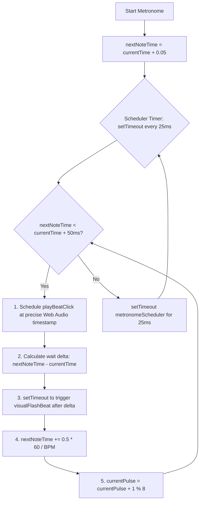

# Metronome Scheduler & Practice Board Synchronization

Acoustic Companion features a high-precision metronome scheduler, a tap tempo tracking system, and a dynamically synchronized practice engine. This document details the lookahead scheduling algorithms, the mathematics of tap tempo smoothing, and the event-driven lyrics and chord synchronization loops.

---

## 1. High-Precision Lookahead Scheduler

JavaScript's standard timing loops (`setInterval` or `setTimeout`) run on the browser's main execution thread. If the main thread is busy rendering UI, garbage collecting, or scrolling, these timers are subject to arbitrary delays, making them too unstable for a musical metronome.

To solve this, the metronome combines lightweight scheduling intervals with the high-precision hardware clock of the Web Audio API (`audioCtx.currentTime`):



### 1. Scheduler Parameters
* **`LOOKAHEAD`**: `25.0 ms`. The frequency with which the scheduler runs.
* **`SCHEDULE_WINDOW`**: `50.0 ms`. How far into the future the scheduler searches for beats to queue. By scheduling notes 50ms in advance, we ensure that even if a thread block occurs, the audio driver already holds the next beat buffer.

### 2. Audio Scheduling Loop
The scheduler runs a recursive timeout loop `metronomeScheduler()` that continuously schedules audio beats until stopped:

```javascript
function metronomeScheduler() {
    while (nextNoteTime < audioCtx.currentTime + (SCHEDULE_WINDOW / 1000)) {
        scheduleBeat(currentPulse, nextNoteTime);
        advanceBeat();
    }
    schedulerTimer = setTimeout(metronomeScheduler, LOOKAHEAD);
}
```

Each pulse represents an eighth note. The scheduler advances time using the formula:

$$\Delta t_{\text{beat}} = 0.5 \cdot \left(\frac{60.0}{\text{BPM}}\right) = \frac{30.0}{\text{BPM}}$$

$$\text{nextNoteTime}_{k+1} = \text{nextNoteTime}_k + \Delta t_{\text{beat}}$$

$$\text{pulse}_{k+1} = (\text{pulse}_k + 1) \pmod 8$$

### 3. Precision Visual Synchronization
To ensure visual elements flash in sync with the hardware audio output, `scheduleBeat` computes the exact millisecond delta remaining between the CPU's current execution time and the scheduled Web Audio play time, firing a zero-clamped timeout:

$$\text{Delay}_{\text{visual}} = \max(0, (\text{nextNoteTime} - \text{audioCtx.currentTime}) \cdot 1000)$$

---

## 2. Tap Tempo Smoothing Mathematics

The Tap Tempo feature allows users to set the BPM organically by tapping a button. To maintain engine stability and filter out erratic physical taps, the tracker applies a multi-stage smoothing algorithm:

### 1. Old Tap Filtering
Upon clicking the tap button, the engine fetches `performance.now()` and purges any tap timestamps older than **2.2 seconds (2200ms)**. This filters out old tap history and allows the user to easily reset and start a new tempo tracking session:

$$t_{\text{filtered}} = \{ t_i \in T \mid t_{\text{now}} - t_i < 2200\text{ ms} \}$$

### 2. Interval Averaging
The time difference between consecutive remaining taps is calculated:

$$\Delta t_i = t_i - t_{i-1} \quad \text{for} \quad 1 \le i < M$$

The average tapping interval is computed:

$$\text{Average}(\Delta t) = \frac{1}{M-1} \sum_{i=1}^{M-1} \Delta t_i$$

### 3. BPM Calculation & Clamping
The final BPM is computed and clamped securely between **50 BPM** (slow practice) and **160 BPM** (fast strumming) to keep the lookahead scheduler buffers within stable memory sizes:

$$\text{BPM}_{\text{computed}} = \text{round}\left(\frac{60,000}{\text{Average}(\Delta t)}\right)$$

$$\text{BPM}_{\text{final}} = \max\left(50, \min\left(160, \text{BPM}_{\text{computed}}\right)\right)$$

---

## 3. Practice Board Synchronization Loop

During **Practice Mode**, the precision metronome acts as the master clock. It drives all front-end lyrics, scrolls, chord diagrams, and section highlights on specific pulse triggers:

### 1. Chronological Section Compiling
The application flattens the structured verse/chorus schema of *"Photograph"* into a bar-by-bar array (`flatPracticeMap`) upon boot:

$$\text{flatPracticeMap}[b] \longrightarrow \{ \text{absoluteBar}, \text{section}, \text{relativeBar}, \text{chord}, \text{style}, \text{triggerLineId} \}$$

### 2. Chord Change Warning (Pulse 6 Trigger)
To help beginners transition their fretting hands in time, a split-second warning is triggered on **Pulse 6 (Beat 4 &)** of the preceding bar:
1. The engine checks if the upcoming bar features a chord change:
   $$\text{chord}_{b+1} \ne \text{chord}_b$$
2. If a chord change is imminent, the engine retrieves the next bar's chord badge:
   `badge-pract-${nextInfo.section}-${nextInfo.relativeBar}`
3. It appends the `warning-transition` class, triggering an **amber flashing keyframe animation** that warns the user to prepare their fingers.

### 3. Active Bar Initialization (Pulse 0 Trigger)
On **Pulse 0 (Beat 1)** of every bar, the engine executes a comprehensive layout synchronization loop:
* **Reset Transition Flashes**: Removes all `warning-transition` classes from the DOM.
* **Update Metrics**: Calculates active bar progress:
  $$\text{Progress} = \frac{b_{\text{current}}}{b_{\text{total}}} \cdot 100\%$$
  Updates the `#practice-progress-fill` width bar.
* **Update Prompts**: Updates target indicators to show `"Keep playing: [Chord]"` or `"Up Next: [Next Chord]"`.
* **Redraw Fretboard**: Fetches the active chord fingering from `CHORD_LIBRARY[chord]` and updates the `#fretboard-neck` SVG overlay dots.
* **Highlight Cheat Sheet**: Locates the active chord name in the left progression cheat sheet and toggles the `.active` class.
* **Synchronize Lyrics Scroll**: If the bar contains an active lyrics line trigger (`triggerLineId`), the engine dims all other lyrics lines to `opacity: 0.3`, highlights the active line to `opacity: 1.0`, and centers it smoothly in the viewport:
  ```javascript
  line.scrollIntoView({ behavior: 'smooth', block: 'center' });
  ```
