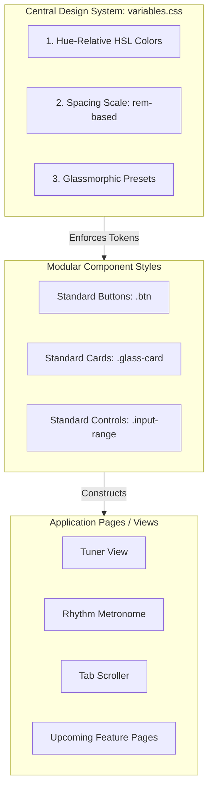

# UI Consistency & Design System Guide

Maintaining UI consistency is one of the most critical challenges in frontend engineering, especially in a **Vanilla CSS & ES Modules** ecosystem without heavy preprocessors (like Sass) or utility-first frameworks (like TailwindCSS). Without a strict framework, styles naturally drift, colors bloat, and padding spacing becomes inconsistent.

This guide outlines how developers maintain visual harmony at scale and provides an actionable **Design System Plan** for the Acoustic Companion codebase.

---

## 1. How Developers Maintain Consistency at Scale

In vanilla environments, developers enforce consistency through three pillars:
1. **Design Tokens (The CSS variables layer)**: Restricting all styling values (colors, spacing, typography, transitions) to a central dictionary.
2. **Component Isolation (Atomic CSS & Modular JS)**: Creating highly reusable, atomic visual building blocks rather than copying and pasting HTML markup.
3. **Structured Page Templates (The Grid Shell)**: Wrapping all page sections in a fixed layout shell so everything aligns to the same grid columns.

---

## 2. Acoustic Companion's Consistency System

Acoustic Companion relies on standard HSL colors and CSS variables under `www/css/variables.css` and `layout.css`. To keep the UI consistent as new pages and features are added, developers use the following structured blueprint:



---

## 3. The 3-Tier Consistency Plan

### Tier 1: Strict Token Enforcement (CSS Variables)
Every custom stylesheet (`tuner.css`, `rhythm.css`, etc.) **must** resolve properties to variables defined in `variables.css`. 

* **The Core Rule**: **Never** write raw hex/RGB colors, pixel sizes, or custom transition times in modular stylesheets.

#### 1. Hue-Relative Color System (HSL)
We use a base hue color (e.g. `24` for standard wooden warmth) to generate harmonized semantic states:
```css
:root {
  --base-hue: 24; /* Changes the entire app tint if adjusted */
  
  /* Semantic Palettes */
  --color-bg: hsl(var(--base-hue), 15%, 8%);
  --color-surface: hsla(var(--base-hue), 12%, 14%, 0.45);
  --color-accent: hsl(var(--base-hue), 72%, 60%);
  --color-green: hsl(142, 68%, 52%);
  --color-amber: hsl(38, 92%, 50%);
  --color-text-primary: hsl(var(--base-hue), 10%, 94%);
  --color-text-secondary: hsl(var(--base-hue), 8%, 68%);
}
```

#### 2. Spacing and Radius Scales
Grid and flex alignments must use standard increments to ensure vertical and horizontal lines align:
```css
:root {
  --space-xs: 0.25rem;  /* 4px */
  --space-sm: 0.5rem;   /* 8px */
  --space-md: 1.0rem;   /* 16px */
  --space-lg: 1.5rem;   /* 24px */
  --space-xl: 2.0rem;   /* 32px */
  
  --radius-sm: 4px;
  --radius-md: 8px;
  --radius-lg: 12px;
  --radius-full: 9999px;
}
```

---

### Tier 2: Glassmorphism & Reusable Component Classes
Rather than styling buttons and sliders uniquely in every component view, we create generic CSS component definitions under a unified sheet (e.g. creating/maintaining a `components.css` or grouping them in `layout.css`).

#### 1. Reusable Glassmorphism Panel
```css
.glass-panel {
  background: var(--color-surface);
  backdrop-filter: blur(16px) saturate(120%);
  -webkit-backdrop-filter: blur(16px) saturate(120%);
  border: 1px solid hsla(var(--base-hue), 100%, 100%, 0.05);
  box-shadow: 0 8px 32px 0 rgba(0, 0, 0, 0.3);
  border-radius: var(--radius-lg);
}
```

#### 2. Reusable Buttons
```css
.btn {
  display: inline-flex;
  align-items: center;
  gap: var(--space-xs);
  padding: var(--space-sm) var(--space-md);
  border-radius: var(--radius-md);
  font-weight: 600;
  transition: all 0.2s cubic-bezier(0.4, 0, 0.2, 1);
  cursor: pointer;
}

.btn-accent {
  background: var(--color-accent);
  color: var(--color-bg);
  border: none;
}

.btn-accent:hover {
  filter: brightness(1.1);
  transform: translateY(-1px);
}

.btn-secondary {
  background: transparent;
  color: var(--color-text-primary);
  border: 1px solid var(--color-text-secondary);
}
```

---

### Tier 3: Asynchronous Web Component Functions (ESM)
In a vanilla JS codebase, we avoid code duplication and visual inconsistencies in dynamic elements by writing **component helper functions** that act like React components.

For example, to render consistent, interactive volume/BPM sliders across different sections:

```javascript
// A reusable slider element builder inside js/components/slider.js
export function createSlider({ id, min, max, initial, label, onChange }) {
    const wrapper = document.createElement("div");
    wrapper.className = "control-slider-group";

    wrapper.innerHTML = `
        <div class="slider-header">
            <span class="slider-label">${label}</span>
            <span class="slider-value" id="${id}-val">${initial}</span>
        </div>
        <input type="range" 
               id="${id}-slider" 
               min="${min}" 
               max="${max}" 
               value="${initial}" 
               class="input-range-slider" />
    `;

    const slider = wrapper.querySelector("input");
    slider.addEventListener("input", e => {
        const val = parseInt(e.target.value);
        wrapper.querySelector(`#${id}-val`).textContent = val;
        onChange(val);
    });

    return wrapper;
}
```

---

## 4. UI Checklist for Adding a New Page or Element

Before committing a new feature or stylesheet, cross-check against these guidelines:

* [ ] **No Hardcoded Colors**: Colors resolve to HSL variables (`var(--color-bg)`, etc.).
* [ ] **No Hardcoded Spacing**: Dimensions use the `rem` spacing scale (`var(--space-md)`, etc.).
* [ ] **Consistent Font Scales**: Typography uses matching weights (`font-weight: 600`, etc.) and sizes.
* [ ] **Consistent Transitions**: Any hover or click animations use the standardized easing duration (`transition: 0.2s cubic-bezier(...)`).
* [ ] **Container Isolation**: Element alignments rely on standard layout grid structures (`layout.css`) rather than arbitrary negative margins.
