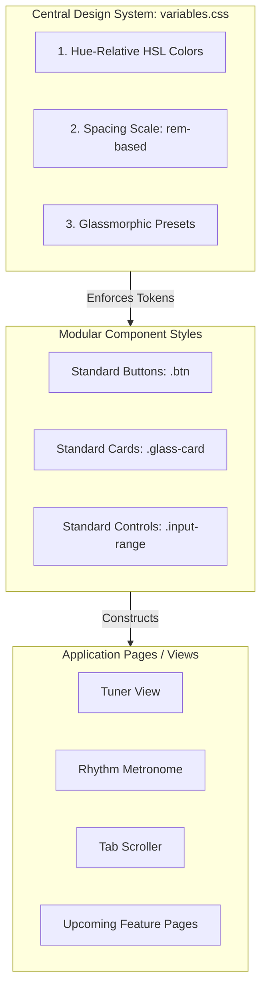

# UI Consistency & Design System Guide

Maintaining UI consistency is one of the most critical challenges in frontend engineering, especially in a **Vanilla CSS & ES Modules** ecosystem without heavy preprocessors (like Sass) or utility-first frameworks (like TailwindCSS). Without a strict framework, styles naturally drift, colors bloat, and padding spacing becomes inconsistent.

This guide outlines how developers maintain visual harmony at scale and provides an actionable **Design System Plan** for the Acoustic Companion codebase.

---

## 1. How Developers Maintain Consistency at Scale

In vanilla environments, developers enforce consistency through three pillars:
1. **Design Tokens (The CSS variables layer)**: Restricting all styling values (colors, spacing, typography, transitions) to a central dictionary.
2. **Component Isolation (Atomic CSS & Modular JS)**: Creating highly reusable, atomic visual building blocks rather than copying and pasting HTML markup.
3. **Structured Page Templates (The Grid Shell)**: Wrapping all page sections in a fixed layout shell so everything aligns to the same grid columns.

---

## 2. Acoustic Companion's Consistency System

Acoustic Companion relies on standard HSL colors and CSS variables under `www/css/variables.css` and `layout.css`. To keep the UI consistent as new pages and features are added, developers use the following structured blueprint:



---

## 3. The 3-Tier Consistency Plan

### Tier 1: Token-First Styling (CSS Variables)
Custom stylesheets (`tuner.css`, `rhythm.css`, etc.) should prefer variables defined in `variables.css` for reusable colors, spacing, typography, shadows, and transitions.

* **The Core Rule**: Avoid raw hex/RGB colors, pixel sizes, or custom transition times when the value represents a reusable design decision. Local geometry values, SVG coordinates, and one-off visual tuning values are acceptable when they are easier to inspect than a token.

#### 1. Hue-Relative Color System (HSL)
We use a central base hue controller (e.g., `24` for golden wood/amber) to generate perfectly harmonized semantic states:
```css
:root {
    /* Central Hue Controller: Golden Wood/Amber (24) */
    --base-hue: 24;

    /* Base Core Colors (HSL-derived for total harmony) */
    --bg-darkest: hsl(var(--base-hue), 15%, 5.5%);      /* Luxurious deep carbon backing */
    --bg-darker: hsl(var(--base-hue), 13%, 8%);        /* Sinking panel layer */
    
    --bg-card-raw: var(--base-hue), 10%, 13.5%;
    --bg-card: hsla(var(--bg-card-raw), 0.68);         /* Perfect glassmorphic opacity */
    --bg-card-hover: hsla(var(--base-hue), 10%, 18%, 0.82);

    /* Borders & Accents (Derived directly from Base Accent HSL) */
    --accent-gold-raw: var(--base-hue), 74%, 60%;
    --accent-gold: hsl(var(--accent-gold-raw));         /* Vibrant acoustic honey gold */
    --accent-gold-glow: hsla(var(--accent-gold-raw), 0.45);
    --accent-gold-faint: hsla(var(--accent-gold-raw), 0.08);
    --accent-orange: hsl(16, 82%, 52%);                 /* Warm bridge orange */

    --border-color: hsla(var(--base-hue), 74%, 60%, 0.12);
    --border-color-hover: hsla(var(--base-hue), 74%, 60%, 0.35);

    /* Premium Warm Typography (Warm Ivory & Ash instead of stark white/gray) */
    --text-primary: hsl(var(--base-hue), 20%, 97%);     /* Warm ivory white */
    --text-secondary: hsl(var(--base-hue), 10%, 72%);   /* Muted warm grey */
    --text-muted: hsl(var(--base-hue), 8%, 46%);        /* Deep shadow ebony */
}
```

#### 2. Spacing and Radius Scales
Grid and flex alignments should use standard increments where practical to keep vertical and horizontal lines aligned:
```css
:root {
    /* Padding & Spacing Levels */
    --space-level-xs: 4px;
    --space-level-sm: 8px;
    --space-level-md: 12px;
    --space-level-lg: 16px;
    --space-level-xl: 24px;

    /* Border Radius Levels */
    --radius-level-sm: 4px;
    --radius-level-md: 8px;
    --radius-level-lg: 12px;
    --radius-level-xl: 16px;
    --radius-level-full: 9999px;
}
```

---

### Tier 2: Glassmorphism & Reusable Component Classes
Rather than styling buttons and sliders uniquely in every component view, we create generic CSS component definitions under a unified sheet (e.g., `layout.css`).

#### 1. Reusable Glassmorphism Panel
```css
.glass-panel {
    background: var(--bg-card);
    backdrop-filter: blur(16px) saturate(120%);
    -webkit-backdrop-filter: blur(16px) saturate(120%);
    border: 1px solid var(--border-color);
    box-shadow: var(--shadow-level-md);
    border-radius: var(--radius-level-lg);
    transition: var(--transition-normal);
}

.glass-panel:hover {
    background: var(--bg-card-hover);
    border-color: var(--border-color-hover);
    box-shadow: var(--shadow-level-lg);
}
```

#### 2. Reusable Buttons & Gradients
```css
.btn {
    display: inline-flex;
    align-items: center;
    gap: var(--space-level-sm);
    padding: var(--space-level-sm) var(--space-level-lg);
    border-radius: var(--radius-level-md);
    font-weight: 600;
    transition: var(--transition-fast);
    cursor: pointer;
}

/* Premium Gold-to-Amber Honey Gradient Button */
.btn-accent {
    background: linear-gradient(135deg, var(--accent-gold), hsl(var(--accent-gold-raw), 0.85));
    color: var(--bg-darkest);
    border: none;
    box-shadow: var(--glow-level-gold);
}

.btn-accent:hover {
    filter: brightness(1.1);
    transform: translateY(-1px);
    box-shadow: var(--glow-level-gold-heavy);
}

.btn-secondary {
    background: var(--bg-card);
    color: var(--text-primary);
    border: 1px solid var(--border-color);
}
```

---

### Tier 3: Asynchronous Web Component Functions (ESM)
In a vanilla JS codebase, we avoid code duplication and visual inconsistencies in dynamic elements by writing **component helper functions** that act like React components.

For example, to render consistent, interactive volume/BPM sliders across different sections:

```javascript
// A reusable slider element builder inside js/components/slider.js
export function createSlider({ id, min, max, initial, label, onChange }) {
    const wrapper = document.createElement("div");
    wrapper.className = "control-slider-group";

    wrapper.innerHTML = `
        <div class="slider-header">
            <span class="slider-label">${label}</span>
            <span class="slider-value" id="${id}-val">${initial}</span>
        </div>
        <input type="range" 
               id="${id}-slider" 
               min="${min}" 
               max="${max}" 
               value="${initial}" 
               class="input-range-slider" />
    `;

    const slider = wrapper.querySelector("input");
    slider.addEventListener("input", e => {
        const val = parseInt(e.target.value);
        wrapper.querySelector(`#${id}-val`).textContent = val;
        onChange(val);
    });

    return wrapper;
}
```

---

## 4. UI Checklist for Adding a New Page or Element

Before committing a new feature or stylesheet, cross-check against these guidelines:

* [ ] **Tokenized Reusable Colors**: Repeated colors resolve to direct HSL tokens (`var(--bg-darkest)`, `var(--bg-card)`, `var(--accent-gold)`, etc.).
* [ ] **Tokenized Reusable Spacing**: Repeated dimensions use the standardized level-based spacing scale (`var(--space-level-md)`, etc.).
* [ ] **Consistent Font Scales**: Typography uses matching weights and font sizes from the hierarchy levels (`var(--font-level-sm)`, `var(--font-level-md)`, etc.).
* [ ] **Consistent Transitions**: Any hover or click animations use standard transitions (`var(--transition-fast)` or `var(--transition-normal)`).
* [ ] **Container Isolation**: Element alignments rely on standard layout grid structures and glassmorphic panels (`layout.css`) rather than arbitrary margins or absolute positionings.
